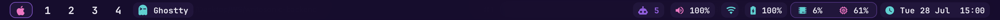
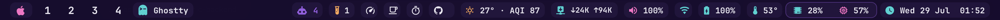
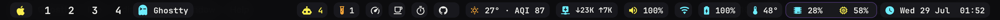
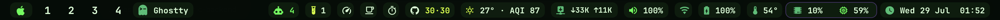
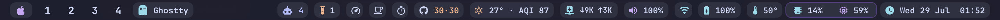
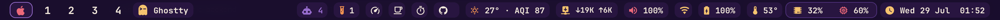

# sketchetc

A themeable, fully interactive macOS menu bar built on [SketchyBar](https://felixkratz.github.io/SketchyBar/).
Free and open source — and it replaces a small pile of paid menu bar apps.



## Replaces ~$120 of paid apps

| Widget | What it does | Replaces |
|---|---|---|
| 󰛴 Network speed | live ↓/↑, click → top-5 bandwidth hogs | iStat Menus ($12) |
| 󰔏 Temps | CPU °C + fan RPM (auto-hides RPM on fanless Macs) | TG Pro ($10) |
| 󰅶 Caffeinate | one-click keep-awake toggle | Lungo ($10) |
| 󰓅 Speedtest | click → Apple's `networkQuality`, result in the bar | Speedtest app |
| 󰔛 Pomodoro | click → 25:00 countdown, spoken finish | Flow ($) |
| 󰤙 Meetings | "Standup in 8m" appears <60 min out, click joins the Zoom/Meet | Meeter ($) |
| 󰊤 GitHub | PRs awaiting your review · your open PRs, click to open | — |
| 󰙨 Dev ports | running dev servers (3000, 5173, 8080…), click to kill | — |
| 󱂬 Window snapping | halves, thirds, maximize, center the frontmost window | Magnet ($8) |
| 󰨚 Quick switches | dark mode, hide desktop icons, empty Trash, screensaver | One Switch ($10) |
| 󰹑 Screenshots | area, window, full screen, to clipboard, 5s timer | CleanShot ($29) |
| 󰂯 Bluetooth | paired devices + battery, click to connect | AirBuddy ($10) |
| 󰕾 Audio switching | pick output device right in the volume popup | SoundSource ($47) |
| 󰚩 AI agents | running claude/codex/gemini sessions with uptime | — |
| 󰃢 Clear RAM | reaps orphaned helpers + purge, then *speaks* the result | CleanMyMac-ish |
| 󰖙 Weather | temp + AQI, color-coded | paid weather widgets |
| + | spaces, front-app switcher, media controls + progress, volume slider, battery health, calendar | — |

| 󰅍 Clipboard history | **Option+V anywhere** → native picker of your last 5 copies (text + image thumbnails), arrow keys + Enter or click to paste — works in terminals too | Paste ($30/yr) / Maccy |
| 󱠇 Aura points | pomodoros scored on real activity (keys/clicks/agents/PRs) → spoken awards, shareable PNG cards ([how](AURA.md)) | — |
| 󱓧 Journal | tamper-evident daily work log: immutable files + hash chain, export any timeframe ([how](JOURNAL.md)) | — |

Everything is **toggleable** from the 󰨝 popover — turn off what you don't want,
it vanishes from the bar. Icons come in three sets (nerd / minimal / emoji),
switchable next to the theme dots in the 󰏘 popover.

## Themes (hot-swap from the 󰀵 menu)

| | |
|---|---|
| **Vice City**  | **Cyberpunk**  |
| **Matrix**  | **Catppuccin**  |
| **Miami Sunset**  | *[add yours →](WIDGETS.md)* |

**Theme Studio** (󰏘 → studio) ships six icon sets (nerd, minimal, outline,
retro, emoji, plain) and full color editing with native pickers. Built-in themes
are read only: Duplicate one, then edit and Apply. A theme is a 12-line file in
`config/themes/`, and every widget uses palette roles, so any theme restyles the
whole bar including popups.

## Feel

- **One popup at a time**, closes on outside click / app switch / mouse-out
- **Reserved space** — windows tile below the bar, never behind it
- **Fullscreen guard** — fullscreening an app converts it to fill-below-the-bar (toggleable)
- Hover glows, bounce animations, all in the active theme's colors
- **Autostarts** on login (brew services / launchd)

## Install

```bash
git clone https://github.com/himanshu007-creator/sketchetc.git
cd sketchetc && ./install.sh
```

Grant the permissions macOS asks for (Accessibility → space switching + fullscreen
guard; Calendar → meetings widget). Everything degrades gracefully if you decline.

## Leave anytime

- **󰀵 menu → "Revert to macOS bar"** — confirmation dialog, then the native bar
  is back instantly (`brew services start sketchybar` returns you).
- `./uninstall.sh` — full clean removal.

## Extend

`WIDGETS.md` — a widget is ~30 lines of bash in two files. `ROADMAP.md` — what's
next (album-art tinting, per-agent token burn, more themes — PRs welcome).

## Credit

Built on [FelixKratz/SketchyBar](https://github.com/FelixKratz/SketchyBar) ·
app icons from [sketchybar-app-font](https://github.com/kvndrsslr/sketchybar-app-font) ·
temps via [macmon](https://github.com/vladkens/macmon).
